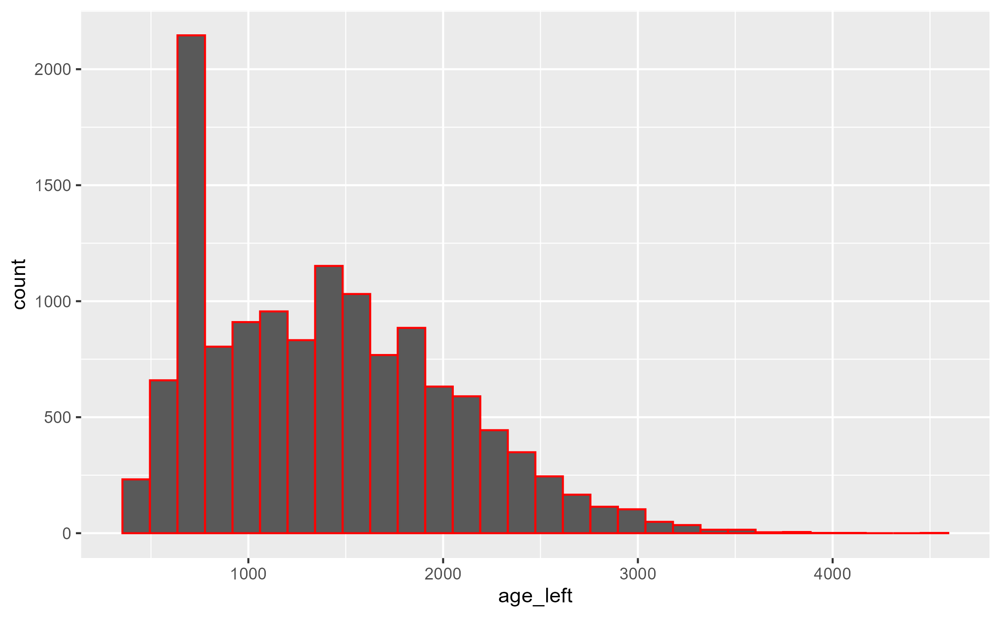

```{r}
#| label: setup
#| include: false
knitr::opts_chunk$set(echo = TRUE)

# Load your packages here
library(tidyverse) #this includes many packages and is the main package used in nearly all data wrangling
library(arrow) #this package handles parquet files
library(skimr) #this is particularly helpful when looking at new data or finding NA values
library(waldo) #we use this to create answer keys for these exercises


```

## Read and Visualize

In this milestone, you'll use ggplot2 to visualize the distribution of age_left for a subset of the data. But before you begin, you'll need to import the animals data set. Unlike with Milestone 1, the animals data set has not been pre-loaded for you to use in R.

## Recreation

### Part 1 - Import

Your goal in this part is to read the animals.parquet file into your environment as an object named ***"animals"***.

-   The animals data set lives in the file `animals.parquet` (think of parquet as just another file extension like .csv, or .doc), which is stored in the `data/intermediate_files` folder in your working directory.

Hint: Start by finding out what your working directory is (hint, for a quarto document it is where that document is saved)

```{r}
getwd()
```

This shows you that we are currently in the folder named "milestones_dairy". This folder lives in the main folder you created for this project.

Next we want to find confirm where the animals.parquet file is located. It is in "data/intermediate_files". You can use the `list.files` function to prove this.

(Hint: remember that paths generally need to be in quotes)

(Hint: "../" means "move up a level")

```{r}
list.files('../data/intermediate_files')
```

Now it is your turn. Write some code in this chunk that will read in the file named "animals.parquet", and name it "animals" in your environment.

```{r}
#| label: recreation-import
#hint the function to read in a parquet file is the same as the code to read a csv file except replace 'csv' with 'parquet'


```

### Part 2 - Visualize

Run the code chunk below to see a plot. Your task is to recreate this plot.

```{r}
#| label: recreate-this
#| message: false


```

Use `ggplot()` in the chunk below to re-create the plot above. Before plotting, you will first need to filter your data set to only include observations from cattle where age_left is more than 1 year.

```{r}
#| label: recreation-visualize


```

## Extension

Using the code chunk below, investigate a research question about this data, using the visualization skills you learned this week. Some ideas:

1.  How does the distribution of age_left differ between breeds? Consider exploring these distributions with other geoms.
2.  What relationships do you see between age_left and other variables of interest in the data set?
3.  \[any other research question of interest\]

Alternately, working with a data set of your own, complete the following:

1.  Read in your data
2.  Filter your data using a logical test/condition
3.  Graph this data subset using at least one geom

```{r}
#| label: extension


```
